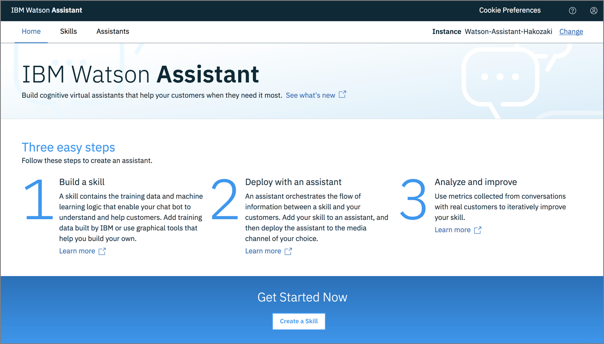
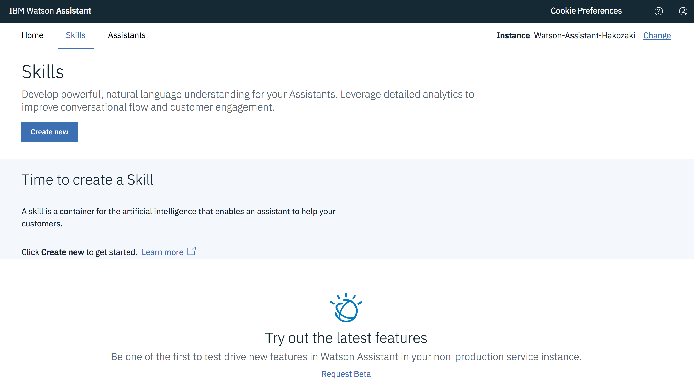
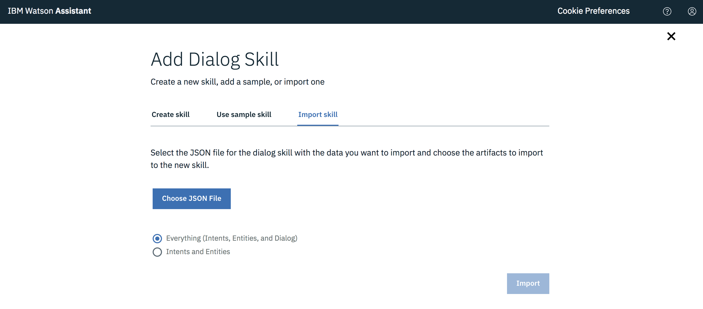

[](https://travis-ci.org/IBM/watson-voice-bot)

# 音声入力と出力でWebベースのチャットボットを作成する

In this code pattern we will create a web based chat bot, but the twist here is that we'll be using voice input and output. For the conversation dialog we'll of course be using Watson Assistant, but we'll also be using Watson Speech To Text to capture the user's voice, and lastly we'll use Watson Text To Speech to playback the chatbots response to the user. The web application itself is built on top of JQuery and Python Flask.

When the reader has completed this code pattern they will understand how to:

* Make a Watson Speech To Text call using a Web Socket Connection
* Make a Watson Text to Speech REST API call
* Send and receive messages to Watson Assistant using REST APIs
* Integrate Watson Speech To Text, Watson Text To Speech and Watson Assistant in a web app


## Flow

1. User selects the microphone option on the browser and speaks.
2. The voice is passed on to Watson Speech To Text using a Web Socket connection.
3. The text from Watson Speech to Text is extracted and sent as input to Watson Assistant.
4. The response from Watson Assistant is passed onto Watson Text to Speech.
5. The audio output is sent to the web application and played back to the user, while the UI also displays the same text.

## Included components

* [Watson Speech-to-Text](https://www.ibm.com/watson/services/speech-to-text/): A service that converts human voice into written text.
* [Watson Text-to-Speech](https://www.ibm.com/watson/services/text-to-speech/): Converts written text into natural sounding audio in a variety of languages and voices.
* [Watson Assistant](https://www.ibm.com/watson/ai-assistant/): Create a chatbot with a program that conducts a conversation via auditory or textual methods.

## Featured technologies

* [Flask](http://flask.pocoo.org/): Python is a programming language that lets you work more quickly and integrate your systems more effectively.
* [jQuery](https://jquery.com/): It is a cross-platform JavaScript library designed to simplify the client-side scripting of HTML.

<!--
# Watch the Video
[](https://www.youtube.com/watch?v=Jxi7U7VOMYg)
-->

# Steps

We'll have two methods to run this application: [using an easy one-click deploy option](#using-the-deploy-to-ibm-cloud-button), or [locally with a few CLI tools](#run-the-application-locally). Depending on your objective, learning or seeing the app quickly, choose accordingly.

## Using the `Deploy to IBM Cloud` button

> If you prefer to deploy the application manually, scroll down to the next section.

Steps:

1. [Clone the repo](#1-clone-the-repo)
2. [Create the services and deploy the web app](#2-create-the-services-and-deploy-the-web-app)
3. [Upload the Watson Assistant workspace](#3-upload-the-watson-assistant-workspace)
4. [Configure environment variables](#4-configure-environment-variables)

### 1. リポジトリのクローンする

Clone the `watson-voice-bot` repo locally. In a terminal, run:

```
git clone https://github.com/IBM/watson-voice-bot
```

We’ll be using the file [`data/workspace.json`](data/workspace.json).

### 2. サービスを作成してWebアプリをデプロイする

The next step is to deploy the application, we'll do this by clicking the button below. A nice byproduct of doing this is that the services required (Speech-to-Text, Text-to-Speech, and Assistant) will be created automatically. Click the button below.

[](https://cloud.ibm.com/devops/setup/deploy?repository=https://github.com/IBM/watson-voice-bot.git)

When the DevOps Toolchain Pipeline appears, click on the `Deploy` button to start the deployment. You can optionally, click on the `Delivery Pipeline` to watch the logs as the app is deployed.


Once deployed, the app can be viewed by clicking `View app`. The app can also be viewed in the dashboard. The app should be prefixed with the string `watson-voice-bot-`, and the corresponding services that were created can easily be identified by the `wvb-` prefix, i.e.: `wvb-assistant`.

### 3. Watson Assistant workspaceのアップロード

Now that our services are created and the app is deployed we need to update the application to use a specific Watson Assistant dialog. We'll be using the file [`data/workspace.json`](data/workspace.json), which documents our entire conversation dialog. To do this, launch the Watson Assistant tool and use the `import` icon button on the right. Find the [`data/workspace.json`](data/workspace.json) file from the cloned repo and import that to the Watson Assistant tool.

Each workspace in Watson Assistant has a specific ID. To find the `Workspace ID` for a given workspace, click the context menu of the workspace and select `View details`. The workspace ID can be copied and saved as we'll need it in the next step.

Optionally, to view the conversation dialog select the workspace and choose the **Dialog** tab. Here's a snippet of the dialog:


### 4. 環境変数を設定する

The last step to perform is to configure our application to use the right Watson Assistant dialog. We'll solve this by specifying the workspace ID as an environment variable that the web application has access to read. To do this we'll navigate to our application overview from the [IBM Cloud Dashboard](https://cloud.ibm.com/dashboard/apps/), searching for `watson-voice-bot` and clicking on the name.

From the application overview, we can click on the `Runtime` menu located in the navigation bar on the left. Select the `Environment Variables` tab. Scroll down and click on `Add`.


We'll add the environment variable key name as `WORKSPACEID` and for the value we'll use the workspace ID from Step 3. Click `Save` and wait for the application to reload.

Once the application restarts, click on the generated URL and start interacting with your voice enabled chatbot! See [Sample output](#sample-output) for things to say to your chatbot.

## ローカルでアプリを実行する方法

1. [Clone the repo](#1-clone-the-repo)
2. [Create Watson services with IBM Cloud](#2-create-watson-services-with-ibm-cloud)
3. [Upload the Watson Assistant workspace](#3-upload-the-watson-assistant-workspace)
4. [Configure `.env` with credentials](#4-configure-env-with-credentials)

### 1. リポジトリをクローンする

`watson-voice-bot` リポジトリをクローンしてローカルに格納する。


コマンドを利用する場合は、次のコマンドを実行する。
```
git clone https://github.com/ayatokura/watson-voice-bot.git
```

後ほど「watson-voice-bot」の「data」フォルダ内に格納されている [`data/workspace.json`](data/workspace.json) ファイルを利用します。

### 2. IBM CloudでWatson APIを作成する

次の3つのWatson APIサービスを作成する。

* [**Watson Assistant**](https://cloud.ibm.com/catalog/services/conversation)
* [**Watson Speech To Text**](https://cloud.ibm.com/catalog/services/speech-to-text)
* [**Watson Text To Speech**](https://cloud.ibm.com/catalog/services/text-to-speech)

### 3. Watson Assistant workspaceをアップロードする

リソース・リストの先ほど作成した「Watson Assistant」を指定し、「ツールの起動」ボタンをクリックする。

「IBM Watson Assistant」画面で「Skills」→「Create New」を選択する。


「Create New」を選択する。


「Add Dialog Skill」で「Import Skill」タブから「Choose JSON file」ボタンをクリックし、ローカルに格納されている「workspace.json」を指定した後に「Import」ボタンでファイルをアップロードする。


### 4. `.env` ファイルでクレデンシャルを設定する

サンプルの環境ファイル sample.env ファイルを .env というファイル名でコピーを作成する。

コマンドから操作を行う場合は次のコマンドを実行する。

```
cp sample.env .env
```

.env ファイルにクレデンシャル情報を追加し、保存する。


#### `env.sample`

```
# Replace the credentials here with your own.
# Rename this file to .env before starting the app.

# Watson Assistant
WORKSPACE_ID=<add_assistant_workspace>
ASSISTANT_URL=<add_assistant_url>
## Un-comment and use either username+password or IAM apikey.
# ASSISTANT_USERNAME=<add_assistant_username>
# ASSISTANT_PASSWORD=<add_assistant_password>
# ASSISTANT_IAM_APIKEY=<add_assistant_apikey>

# Watson Speech To Text
SPEECHTOTEXT_USER=<add_stt_username>
SPEECHTOTEXT_PASSWORD=<add stt password>

# Watson Text To SpeechToText
TEXTTOSPEECH_USER=<add tts username>
TEXTTOSPEECH_PASSWORD=<add tts password>
```

### 5. アプリケーションを実行する

1. アプリケーションを実行する `python welcome.py`
2. Webブラウザで [http://localhost:5000](http://localhost:5000) へアクセスする。
3. Webブラウザで音声を有効にし、テストする。

# サンプルのアウトプット

以下のスクリプトに従って保険ドメインのサンプルを利用するか、またはWatson Assistantの下で独自のダイアログを構成してください。

```
Voice Bot: Hello. How can I help you?
User : I am trying to buy an insurance

Voice Bot: You have come to the right place We offer you a smart, affordable and convenient way to safeguard the future for you and your family. Can I ask you a couple of questions to come up with the best plan for you?
User Reply: ok sure

Voice Bot: Please tell me your Name followed by Date Of Birth and Annual Income
User Reply: This is Mary

Voice Bot: Please enter your Date of Birth
User Reply: 2nd June 1945

Voice Bot: Your annual income?
User Reply: 1200000 dollars

Voice Bot: Do you smoke?
User Reply: Nope I dont

Voice Bot: Please tell me your gender
User Reply: Female

Voice Bot: Enter a protection type
Select one among Basic Life Cover, Fixed Income Protection or Increasing Income Protection.
User Reply: Life Cover

Voice Bot: What premium payment frequency would you prefer? Monthly, Quarterly, Half Yearly or Yearly?
User Reply: Monthly

Voice Bot: What term would you want to go for? Enter a range between 10 years to 35 years.
User Reply: 8 years

Voice Bot: Please enter a term ranging between 10 years to 35 years.
User Reply: 12

Voice Bot: Your yearly premium for 12 years under the Basic Life Cover plan is 67767 dollars. Do you want to try any other options or go ahead with buying this?
User Reply: No What is Basic Life Cover?

Voice Bot: On death during the Policy term, Sum Assured as a lump sum is paid to the nominee and the policy terminates.
User Reply: ok Thanks

Voice Bot: Have a great day
```


# 参考リンク

* [Watson Node.js SDK](https://github.com/watson-developer-cloud/node-sdk)
* [Relevancy Training Demo Video](https://www.youtube.com/watch?v=8BiuQKPQZJk)
* [Relevancy Training Demo Notebook](https://github.com/akmnua/relevancy_passage_bww)

# もっと詳しく学ぶ

* **Artificial Intelligence Code Patterns**: Enjoyed this Code Pattern? Check out our other [AI Code Patterns](https://developer.ibm.com/code/technologies/artificial-intelligence/).
* **AI and Data Code Pattern Playlist**: Bookmark our [playlist](https://www.youtube.com/playlist?list=PLzUbsvIyrNfknNewObx5N7uGZ5FKH0Fde) with all of our Code Pattern videos
* **With Watson**: Want to take your Watson app to the next level? Looking to utilize Watson Brand assets? [Join the With Watson program](https://www.ibm.com/watson/with-watson/) to leverage exclusive brand, marketing, and tech resources to amplify and accelerate your Watson embedded commercial solution.

# ライセンス
This code pattern is licensed under the Apache Software License, Version 2.  Separate third party code objects invoked within this code pattern are licensed by their respective providers pursuant to their own separate licenses. Contributions are subject to the [Developer Certificate of Origin, Version 1.1 (DCO)](https://developercertificate.org/) and the [Apache Software License, Version 2](http://www.apache.org/licenses/LICENSE-2.0.txt).

[Apache Software License (ASL) FAQ](http://www.apache.org/foundation/license-faq.html#WhatDoesItMEAN)
